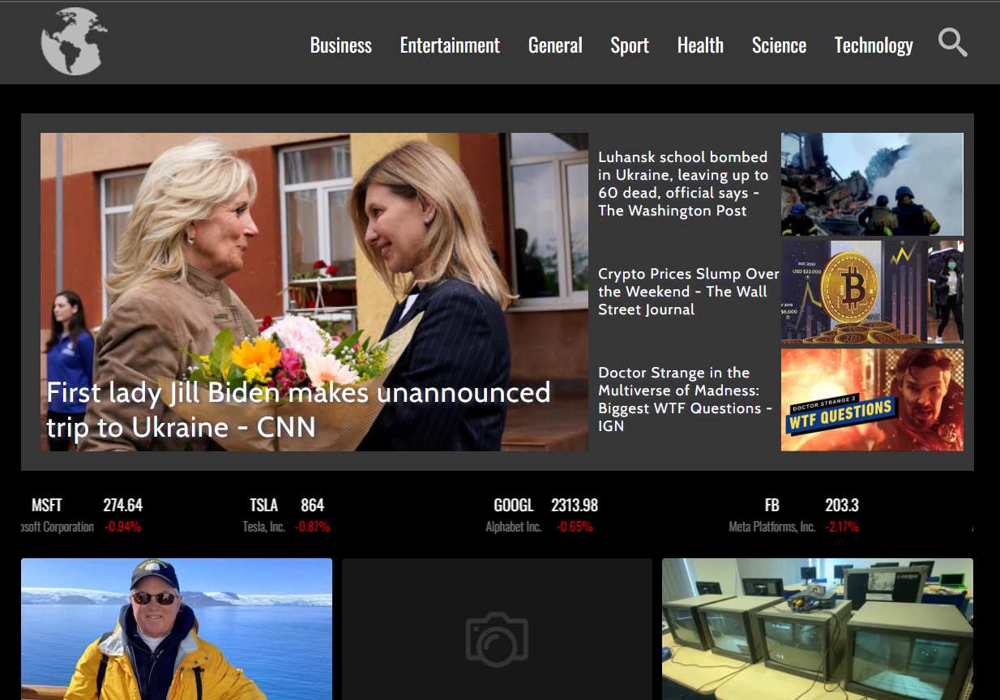

# <News>

## About
 You can see all the latest news from all over the world here. In addition, information from the stock exchange and the currency market can also be found on our page.Thanks to us, the weather in your city will always be known.

## Demo

 Here is a working live demo : [DEMO](https://marcin082.github.io/livescore-app/)





## Built with
* TypeScript
* Css
* React
* Styled Components
* Redux
* [NewsApi](https://newsapi.org/)

## Installation

### Install Node JS
Refer to [https://nodejs.org/en/](https://nodejs.org/en/) to install nodejs

### Install create-react-app
Install create-react-app npm package globally. This will help to easily run the project and also build the source files easily. Use the following command to install create-react-app

```bash
npm install -g create-react-app
```

## Cloning and Running the Application in local

Clone the project into local

Install all the npm packages. Go into the project folder and type the following command to install all npm packages

```bash
npm install
```

In order to run the application Type the following command

```bash
npm start
```

The Application Runs on **localhost:3000**

